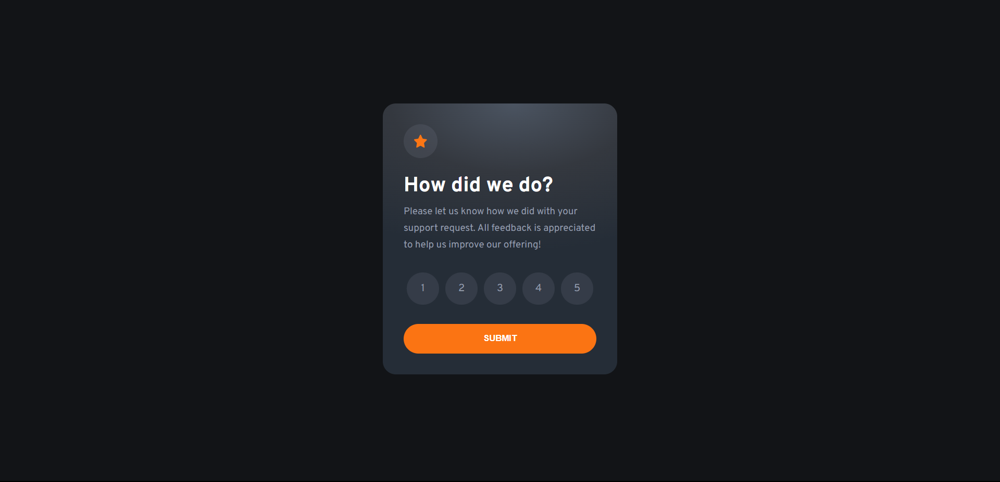
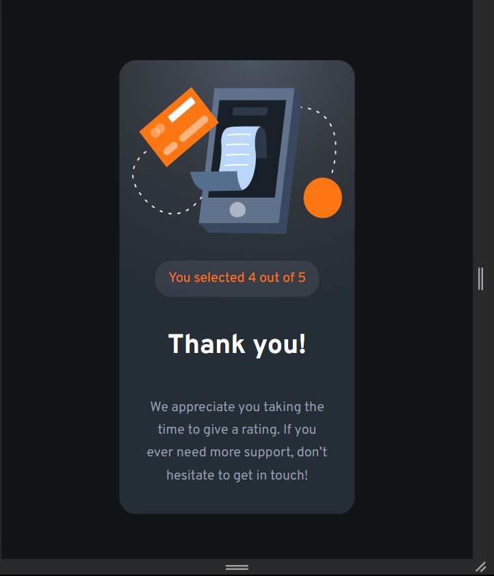

# Frontend Mentor - Interactive rating component solution

This is a solution to the [Interactive rating component challenge on Frontend Mentor](https://www.frontendmentor.io/challenges/interactive-rating-component-koxpeBUmI). Frontend Mentor challenges help you improve your coding skills by building realistic projects. 

## Table of contents

- [Overview](#overview)
  - [The challenge](#the-challenge)
  - [Screenshot](#screenshot)
  - [Links](#links)
- [My process](#my-process)
  - [Built with](#built-with)
  - [What I learned](#what-i-learned)
  - [Continued development](#continued-development)
  - [Useful resources](#useful-resources)
- [Author](#author)

## Overview

### The challenge

Users should be able to:

- View the optimal layout for the app depending on their device's screen size
- See hover states for all interactive elements on the page
- Select and submit a number rating
- See the "Thank you" card state after submitting a rating

### Screenshot

### Links

- Solution URL: (https://github.com/hassanmoaa/interactive-rating-component-FrontEndMentor.git)
- Live Site URL: (https://thunderous-horse-5dbabe.netlify.app/)

### Built with

- Semantic HTML5 markup
- CSS custom properties
- Flexbox
- Google Fonts
- Vanilla JavaScript

### What I learned

numberElBtn.forEach(btn => {
    btn.addEventListener('click',function () {

        rating = this.dataset.ratingNumber
        ratingElNumber.innerText = `You selected ${rating} out of 5`

    });
})

submitBtn.addEventListener("click", function() {
    if (rating === 0) {
        window.alert("You need to first select a rating number")
    } else {
        thankYouPage.style.display = "flex"
        mainPage.style.display = "none"
    }
})

### Continued development

- I want to learn more about css by creating multi-page websites

### Useful resources
- [@i-Bex] helped me alot during this project with CSS and JS mainly fixing some issues and leading me to the right path together!
- (https://www.w3schools.com) - W3S helped me getting some help!

## Author
- GitHub -  [@i-Bex](https://github.com/i-Bex)
- Frontend Mentor - [@hassanmoaa](https://www.frontendmentor.io/profile/hassanmoaa)
